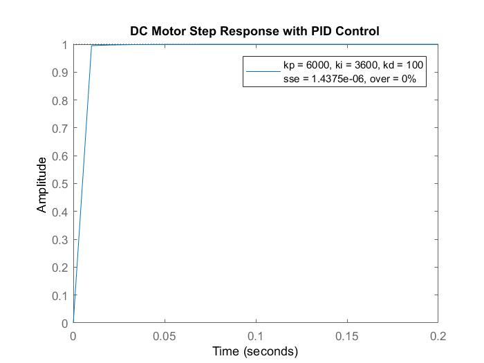

# AnalogMC
PID DC motor control modeling through LTspice and MATLAB (2018).
Created for the Quantitative Engineering Analysis course at [Olin College of Engineering](www.olin.edu), Fall 2018.

### [Paper](QEA_Adventure.pdf) Abstract
"This paper examines analog PID control as it relates to a DC motor controller circuit. Our goal was to analyze controls through analog circuitry. In order to do this we derived op-amp circuits that are analogous to PID control blocks in order to create a velocity control scheme. We simulated a motor model in MATLAB with control coefficients for a specific motor. Then we derived transfer functions for op-amp gain, integrator, and differentiator circuits so we could compare the analog control transfer functions to our MATLAB controls simulation. Based on analysis of the steady state error and percentage overshoot, we find good control constants kp = 6000, Ki = 3600, and Kd = 100 to get the motor to reach a desired velocity in less than 0.025 seconds."

### Results

"Proportional Integral Derivative Control. Finally, when we combine these concepts and use PID control, we get a combination of the quick reaction of the proportional controller, the reduction in steady state error from the PI controller, and the damping effect of the PD controller. The result, as shown in Figure 7, is a step response that approaches steady state within 0.025 seconds, has a steady state error of 1.4375e-06, and does not overshoot at all. In this idealized simulation in MATLAB, we settled on values of Kp = 6000, Ki = 3600, and Kd = 100, to achieve such a low steady state error and quick response time, however, when we apply this in analog circuitry we will find that we have to choose K constants that are within the voltage range of our circuit and within the range of available resistor and capacitor values."

### Credits
Authors: [Corey Cochran-Lepiz](https://github.com/coreyacl) and [Vienna Scheyer](https://github.com/scheyer).

